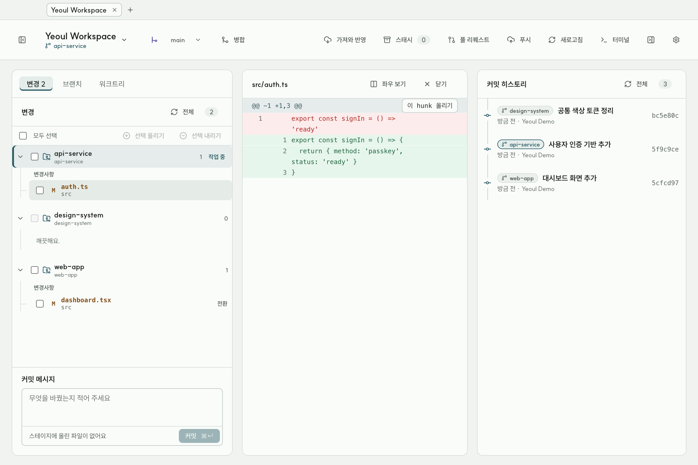
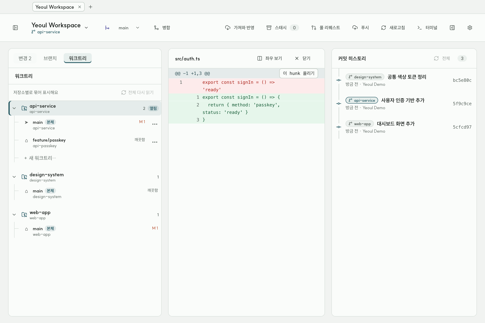

# 여울 (Yeoul)

여러 Git 저장소와 워크트리를 한 작업 공간에서 살펴보고, 변경 검토부터 커밋·동기화까지 이어가는 macOS Git GUI입니다.

[최신 버전 다운로드](https://github.com/tkddu1591/yeoul-releases/releases/latest) · [문제 제보](https://github.com/tkddu1591/yeoul/issues) · [릴리스 기록](docs/releases/v0.2.0.md)



## 왜 여울인가요?

기존 Git GUI에서 워크트리는 종종 부가 기능으로 취급됩니다. 여울은 저장소와 워크트리를 처음부터 같은 작업 단위로 다룹니다. 여러 저장소를 오갈 때도 변경 목록, 브랜치, 커밋 히스토리와 터미널의 맥락이 끊기지 않는 것을 목표로 합니다.

- 여러 저장소와 워크트리를 하나의 통합 트리에서 탐색
- 변경 파일 검토, stage/unstage, 커밋, push/pull
- 브랜치 생성·전환·병합·rebase와 스태시 관리
- 충돌 구간을 카드 단위로 선택하거나 직접 편집
- 로컬·원격·태그를 함께 보여 주는 커밋 그래프
- 워크트리별 실제 셸 터미널과 외부 변경 자동 감지
- GitHub Pull Request 생성·검토·승인·병합
- 라이트·다크 테마와 창·탭·패널 상태 복원



## 현재 상태

여울은 **macOS 공개 베타**입니다. Apple Silicon과 Intel Mac을 함께 지원하는 Universal 빌드를 배포합니다.

현재 무료 배포본은 Apple Developer ID 공증이 없는 ad-hoc 서명입니다. 첫 실행에서 macOS가 차단하면 Finder에서 여울을 우클릭하고 `열기`를 선택해야 할 수 있습니다. 중요한 저장소는 원격에 백업한 뒤 사용해 주세요.

### 설치

1. [최신 릴리스](https://github.com/tkddu1591/yeoul-releases/releases/latest)에서 Universal DMG를 내려받습니다.
2. DMG를 열고 여울을 `응용 프로그램` 폴더로 옮깁니다.
3. 처음 실행이 차단되면 Finder에서 여울을 우클릭한 뒤 `열기`를 선택합니다.

여울은 공개 바이너리 저장소의 새 버전을 확인하고, 다운로드한 DMG의 SHA-512를 검증한 뒤 설치 파일을 열어 줍니다. Developer ID 서명·공증을 적용하기 전에는 앱이 스스로 실행 파일을 교체하지 않습니다.

## 개발하기

### 요구사항

- macOS
- Node.js 22 이상
- pnpm 10
- Git 2.28 이상

```bash
pnpm install
pnpm --filter @git-gui/desktop dev
```

### 검증

```bash
pnpm lint
pnpm typecheck
pnpm test
pnpm --filter @git-gui/desktop e2e
```

### 로컬 패키징

```bash
pnpm --filter @git-gui/desktop package
```

Universal `.app`, DMG와 ZIP은 `apps/desktop/dist/`에 생성됩니다. 자세한 배포 절차는 [macOS 릴리스 문서](docs/RELEASING.md)를 참고해 주세요.

## 구조

여울은 UI와 Git 실행 경계가 섞이지 않도록 pnpm workspace 패키지로 역할을 나눕니다.

| 패키지 | 역할 |
| --- | --- |
| `apps/desktop` | Electron main/preload/renderer와 데스크톱 UI |
| `packages/domain` | Git 상태와 작업 규칙을 표현하는 순수 도메인 |
| `packages/git-adapter` | Git 출력 파싱과 도메인 변환 |
| `packages/git-process` | Git 프로세스 실행·취소·스트리밍 |
| `packages/hosting` | GitHub API 연동 |
| `packages/ipc-contract` | main과 renderer 사이 IPC 타입 계약 |

설계 배경은 [제품 목적과 범위](docs/PRODUCT_VISION.md), 지원하려는 흐름은 [Git 시나리오 카탈로그](docs/GIT_SCENARIOS.md)에서 확인할 수 있습니다.

## 보안과 개인정보

- GitHub 토큰은 Electron `safeStorage`로 암호화해 로컬에 저장합니다.
- Crashpad 덤프와 진단 로그는 자동 전송하지 않고 사용자 컴퓨터에만 보관합니다.
- 취약점은 공개 이슈 대신 [보안 정책](SECURITY.md)의 비공개 신고 방법을 이용해 주세요.

## 기여하기

버그 제보, 사용성 의견과 코드 기여를 환영합니다. 큰 변경은 구현 전에 이슈에서 방향을 먼저 맞춰 주세요. 개발 환경과 검증 기준은 [기여 안내](CONTRIBUTING.md)를 참고해 주세요.

## 라이선스

[MIT License](LICENSE)
